# 구매 패턴 기반 고객 페르소나 도출 후 채널 오분류 고객 마케팅 전략

**작성자:** 김정우, 안재원 | **작성일:** 2026-09-04
**데이터:** Wholesale customers (Cardoso, M., 2013 / Kaggle 재배포) — 440행 × 8열

---

## 요약 (Executive Summary)

- 도매업체 고객 440명의 품목별 연간 구매액 6개 변수만으로 고객을 **4개 페르소나**로 군집화했다. 페르소나는 **품목 구성(신선 vs 가공·생활용품) × 구매 규모(소량 vs 대량)** 의 2×2 구조를 이룬다.
- 채널 정보 없이 구매 패턴만으로 채널(Horeca / Retail)을 예측한 결과, 최종 모델 `RandomForest`가 **Test Accuracy 95.5%, Macro F1 0.948** 을 기록했다(기준선 67.7% 대비 약 28%p 향상).
- 채널 구분의 핵심 변수는 **Detergents_Paper · Grocery · Milk** 로, 세 변수가 변수 중요도의 약 72%를 차지한다.
- Test 88명 중 오분류 고객 4명(4.5%)은 무작위 오류가 아니라 **라벨-행동 불일치형 / 카테고리 이탈형 / 규모 이상치형** 세 유형으로 나뉜다. 유형별로 액션 강도를 달리한 마케팅 전략을 제안한다.
- 다만 오분류 분석은 Test 88명 중 4명에 근거하므로, 440명 전체로 예측을 넓혀 유형 분류를 검증하는 것이 향후 과제다.

---

## 분석 개요

### 분석 주제

도매업체 고객의 품목별 구매 데이터로 고객 유형을 군집화하고, 채널 분류모형을 만들어 페르소나별 채널 분포를 확인한 뒤 채널 오분류 고객에 대한 마케팅 전략을 제안한다.

### 분석 질문

| 단계 | 질문 |
|---|---|
| 1단계 (군집) | 이 도매업체 고객은 몇 종류인가? |
| 2단계 (분류) | 채널 정보 없이도 고객 채널을 구분할 수 있는가? |
| 3단계 (연결) | 각 페르소나는 어느 채널에 몰려 있으며, 오분류 고객에게는 어떤 마케팅을 해야 하는가? |

- **종속변수:** `Channel` (명목형, 1: Horeca(호텔·레스토랑·카페), 2: Retail(소매유통))

---

## 1. 데이터 품질 점검 및 데이터 전처리

### 1-1. 데이터 구조 점검

#### 출처와 분석 단위

- **출처:** Cardoso, M. (2013) Wholesale customers — Kaggle 재배포
- **데이터 크기:** 440행 × 8열
- **분석 단위:** 1행 = 고객 1명

#### 변수 정의

| 변수명 | 의미 | 역할 | 척도 | 단위 / 값 | 채널과 관련 있다고 보는 이유 |
|---|---|---|---|---|---|
| `Channel` | 고객 채널 | 종속변수 | 명목형 (2집단) | 1: Horeca, 2: Retail | - |
| `Region` | 고객 지역 | 독립변수 (분석 제외) | 명목형 (3집단) | 1: Lisbon, 2: Oporto, 3: Other | - |
| `Fresh` | 신선식품 연간 구매액 | 독립변수 | 연속형 | monetary unit | 신선도 유지·요리 목적으로 Retail보다 Horeca에서 더 많이 쓰임 |
| `Milk` | 유제품 연간 구매액 | 독립변수 | 연속형 | monetary unit | Horeca와 Retail 양쪽 모두 많이 쓰임 |
| `Grocery` | 식료품 연간 구매액 | 독립변수 | 연속형 | monetary unit | Horeca는 필요한 양만 구매하므로 Retail에서 더 많이 쓰임 |
| `Frozen` | 냉동식품 연간 구매액 | 독립변수 | 연속형 | monetary unit | 조리 원재료로 대량 비축하므로 Retail보다 Horeca에서 더 많이 쓰일 것으로 예상 |
| `Detergents_Paper` | 세제·종이류 연간 구매액 | 독립변수 | 연속형 | monetary unit | Horeca에서도 소비하지만 Retail은 판매 상품으로 더 많이 쓰임 |
| `Delicassen` | 즉석·가공식품 연간 구매액 | 독립변수 | 연속형 | monetary unit | Horeca보다 Retail에서 더 많이 쓰임 |

#### 초기 가설

| 단계 | 가설 |
|---|---|
| 1단계 | **가설1.** 품목별 구매 비중에 따라 고객은 최소 2개 이상의 뚜렷한 소비 패턴 그룹으로 나뉜다. |
| 1단계 | **가설2.** Horeca 고객은 `Fresh`·`Frozen` 비중이, Retail 고객은 `Grocery`·`Milk`·`Detergents_Paper` 비중이 높다. |
| 2단계 | **가설3.** 분류 모델의 오차는 무작위가 아니라 특정 소비 패턴에 집중된다. |
| 3단계 | **가설4.** 오분류 고객은 단순한 모델 오차가 아니라 실제로 채널과 다른 소비 패턴을 보이는 "채널 전이/혼합형" 고객이다. |
| 3단계 | **가설5.** 오분류 고객군의 구매액은 정분류 고객군과 다르다. |

#### 데이터의 한계

- **수집 기간 불명:** 어느 연도의 구매액인지 알 수 없어 계절성·트렌드를 반영할 수 없다.
- **화폐 단위 불명확:** 실제 통화값인지 지수인지 명시되지 않아, 카테고리 간 **상대적 비중** 위주로 해석한다.

> 따라서 본 분석은 바로 적용할 수 있는 의사결정 결과가 아니라, **"구매 패턴으로 채널 오분류 고객을 식별하고 대응 전략을 설계하는 방법론"을 검증하는 사례**로 설계했다.

### 1-2. 데이터 품질 점검

| 점검 항목 | 결과 | 조치 |
|---|---|---|
| 데이터 타입 | `Channel`, `Region`이 정수형으로 저장됨 | 명목형(category)으로 변환 |
| 중복 행 | 0건 | 없음 |
| 결측치 | 0건 | 없음 |
| 명목형 표기 오류 | 없음 | 없음 |
| 최소값 3 (하한 절단 의심) | `Fresh` 2개, `Grocery` 1개, `Detergents_Paper` 2개, `Delicassen` 4개 | 로그 변환 시 하한 왜곡에 유의 |
| IQR 상한 이상치 | 108행 (24.6%), 채널1 61명 / 채널2 47명 | 대형 고객의 실제 구매로 보고 삭제 대신 변환으로 처리 |

- 6개 연속형 변수 중 4개의 최소값이 똑같이 3이다. 3 다음으로 작은 값은 `Fresh` 9, `Grocery` 137, `Detergents_Paper` 5, `Delicassen` 7이다. `Detergents_Paper`는 다음 값이 5라 3이 실제 값일 수 있지만, 4개 변수의 최소값이 모두 3이라는 점에서 하한 절단값일 가능성이 있어 하한 왜곡에 유의한다.
- 하한 이상치는 없고 이상치는 모두 고액 구매 고객에서 나왔다. 이들은 오류가 아니라 대형 고객의 실제 구매 특성일 수 있으므로 일괄 삭제하지 않았다.

### 1-3. 기술 통계량 및 `Region` 변수 제외

- `Region` 고객 분포가 **Other 316명(71.8%)**, Lisbon 77명(17.5%), Oporto 47명(10.7%)으로 크게 쏠려 있다.

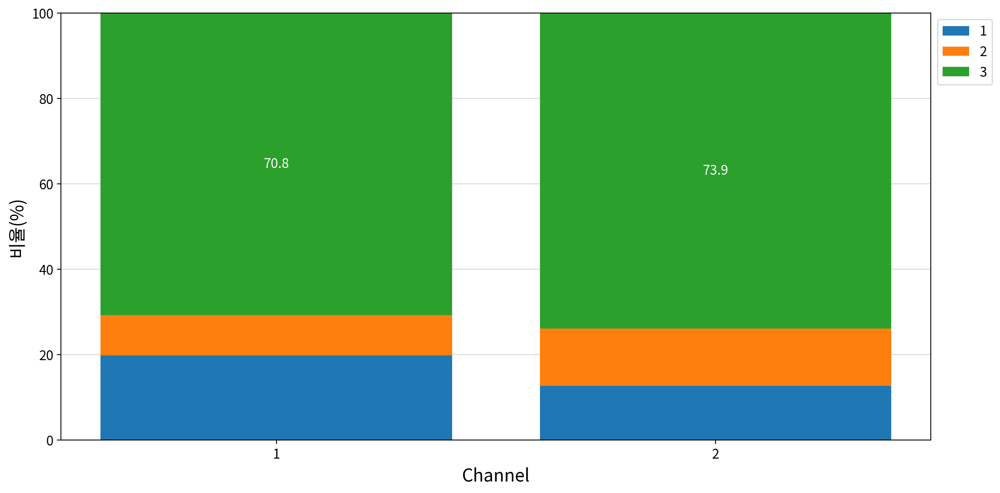
*그림 1. Channel × Region 교차 분포*

- 카이제곱 독립성 검정(`Channel` × `Region`) 결과 **χ² = 4.35, 자유도 2, p = 0.114, Cramér's V = 0.099(Negligible)** 로 유의한 연관이 없다.
- 두 채널 모두 Other 지역에 집중되어 있어 `Region`은 채널을 구분하는 정보력이 없으므로 분석에서 제외했다.

> **1장 결론:** 데이터 품질 문제는 발견되지 않았지만, 분포의 비대칭성, 변수 간 규모 차이, 하한 왜곡에 주의한다.

---

## 2. 탐색적 데이터 분석 (EDA)

### 2-1. 종속변수 단변량 분석

| Channel | 고객 수 | 비율 |
|---|---|---|
| 1 (Horeca) | 298 | 67.7% |
| 2 (Retail) | 142 | 32.3% |

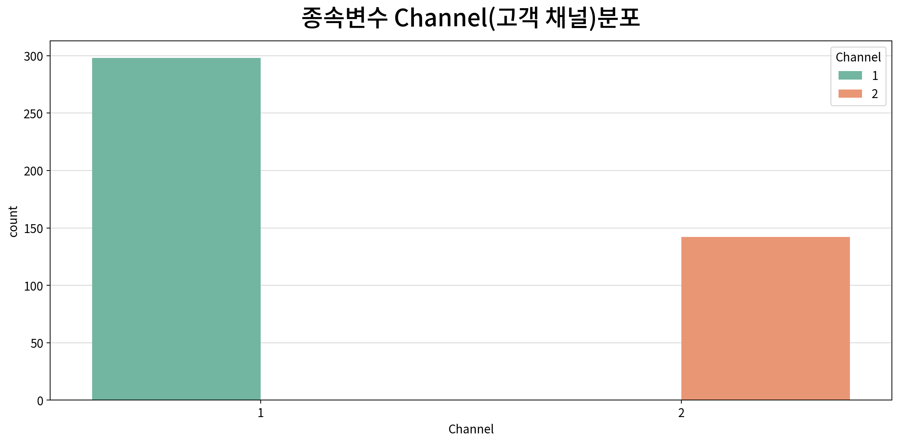
*그림 2. 종속변수 Channel 분포*

- 채널1 67.7% / 채널2 32.3%로, **기대 오분류 규모의 기준선은 약 32.3%** 다. 즉 전원을 Horeca로 예측해도 정답률이 67.7%이므로 이것이 분류 모델의 기준선이다.

### 2-2. 연속형 독립변수 단변량 분석

| 변수 | 평균 | 중앙값 | 평균/중앙값 | 왜도 | 첨도 | 상한 이상치 |
|---|---|---|---|---|---|---|
| `Fresh` | 12,000 | 8,504 | 1.41배 | 2.56 | 11.54 | 20건 (4.5%) |
| `Milk` | 5,796 | 3,627 | 1.60배 | 4.05 | 24.67 | 28건 (6.4%) |
| `Grocery` | 7,951 | 4,756 | 1.67배 | 3.59 | 20.91 | 24건 (5.5%) |
| `Frozen` | 3,072 | 1,526 | 2.01배 | 5.91 | 54.69 | 43건 (9.8%) |
| `Detergents_Paper` | 2,881 | 817 | 3.53배 | 3.63 | 19.01 | 30건 (6.8%) |
| `Delicassen` | 1,525 | 966 | 1.58배 | 11.15 | 170.69 | 27건 (6.1%) |

| | |
|---|---|
| 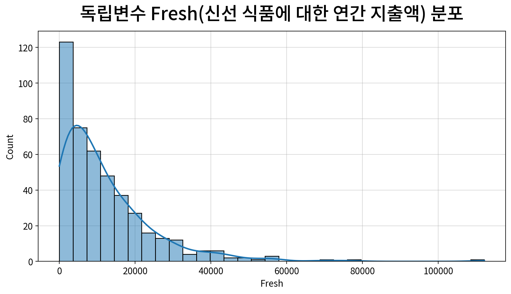 | 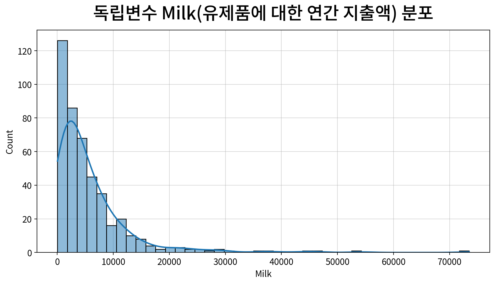 |
| 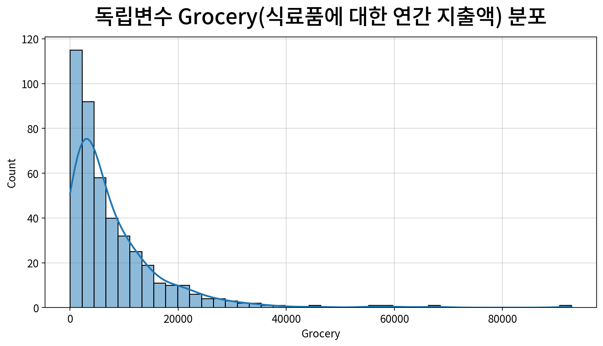 | 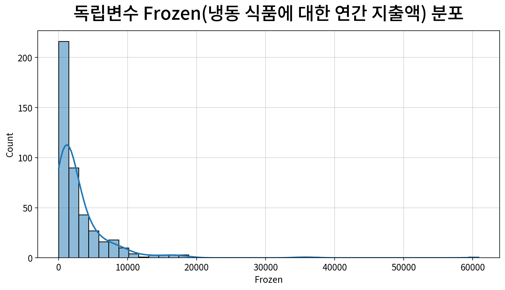 |
| 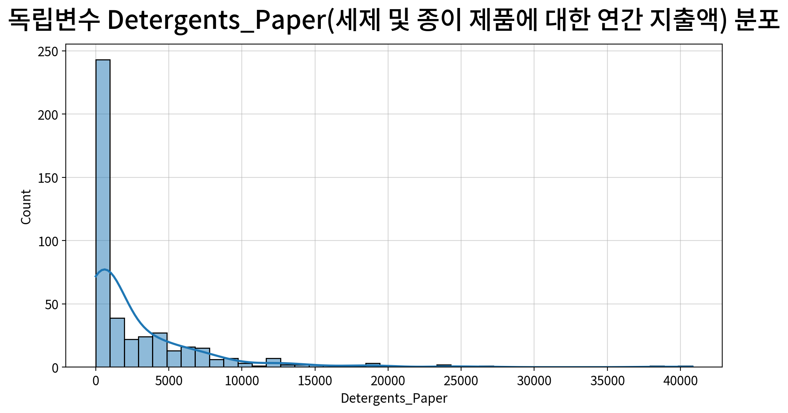 | 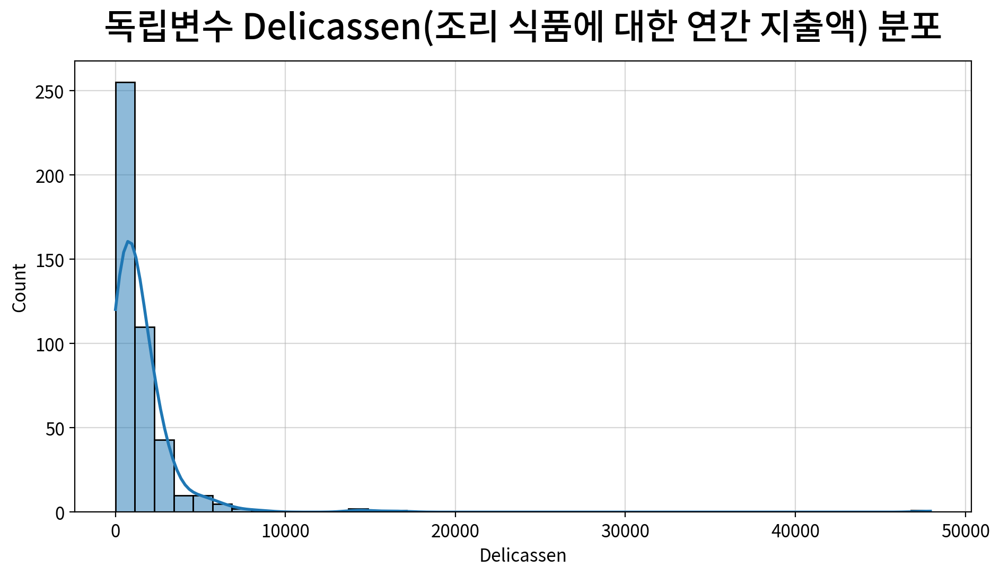 |

*그림 3. 연속형 독립변수 6개의 분포 (히스토그램 + KDE)*

- 6개 변수 모두 왜도가 1 이상인 **강한 우측 꼬리 분포**다. 대부분의 고객은 낮은 구매액에 몰려 있고, 소수 고객의 고액 구매가 평균을 끌어올린다. 그래서 "평균 고객"은 실제 다수 고객을 대표하지 못한다.
- 모든 변수에서 표준편차가 평균보다 커서 변수 간 규모 차이와 극단값의 영향이 크다. 거리 기반 분석 전에 **분포 변환과 표준화가 필요**하다.
- 최소값이 3인 4개 변수는 로그 변환 시 왜도가 음수로 뒤집힐 수 있어, **Box-Cox/Yeo-Johnson** 등 대안을 함께 검토한다. 최종 전처리에서는 하한 왜곡이 확인되어 Yeo-Johnson 변환으로 대체했다(3-1).
- 평균 구매액 기준 매출 기여도는 `Fresh`(36.1%)와 `Grocery`(23.9%)가 합쳐서 약 60%다. 다만 매출 비중이 크다고 채널 구분력이 큰 것은 아니므로, 판별력은 이변량 분석의 효과크기로 따로 확인한다.

### 2-3. 이변량 분석 (채널별 차이)

정규성 검정(normaltest)에서 6개 변수가 모두 정규성을 만족하지 않아 **Mann-Whitney U test**를 사용했다. 효과크기는 Rank-Biserial 상관계수로 판단했다.

| 변수 | p-value | 방향 (채널별 평균) | \|Rank-Biserial\| | 판별력 |
|---|---|---|---|---|
| `Detergents_Paper` | < 0.0001 | Horeca 791 < Retail 7,270 | **0.92** | 강함 |
| `Grocery` | < 0.0001 | Horeca 3,962 < Retail 16,323 | **0.88** | 강함 |
| `Milk` | < 0.0001 | Horeca 3,452 < Retail 10,717 | **0.76** | 강함 |
| `Frozen` | < 0.0001 | Horeca 3,748 > Retail 1,653 | 0.29 | 약함 |
| `Fresh` | 0.0002 | Horeca 13,476 > Retail 8,904 | 0.22 | 약함 |
| `Delicassen` | 0.0005 | Horeca 1,416 < Retail 1,753 | 0.20 | 약함 |

| Fresh | Milk |
|---|---|
| 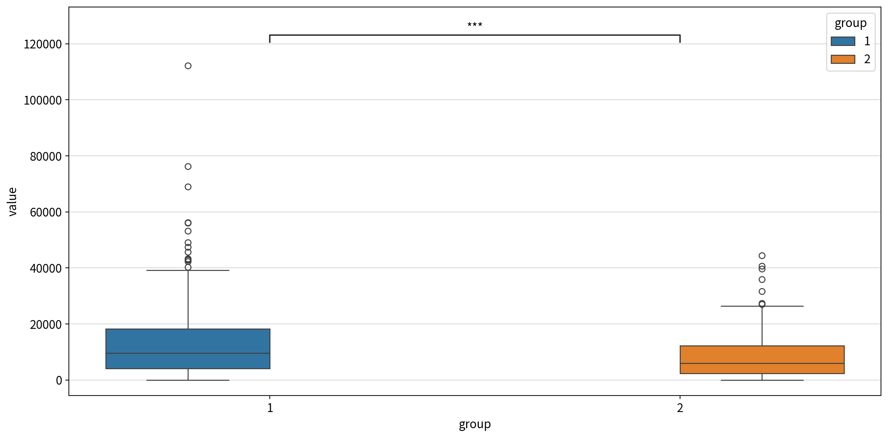 | 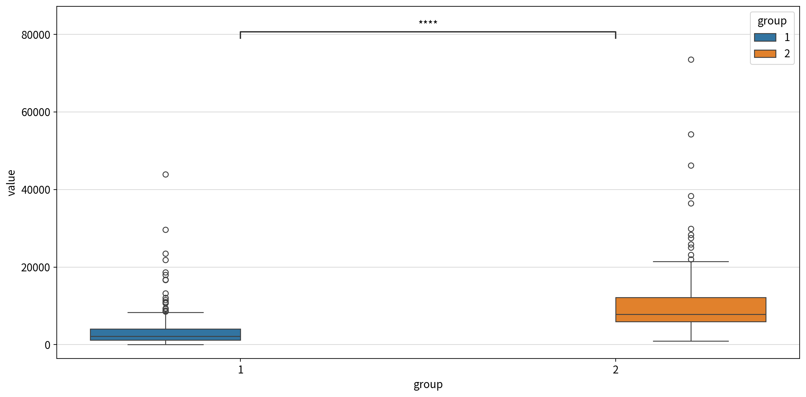 |
| **Grocery** | **Frozen** |
| 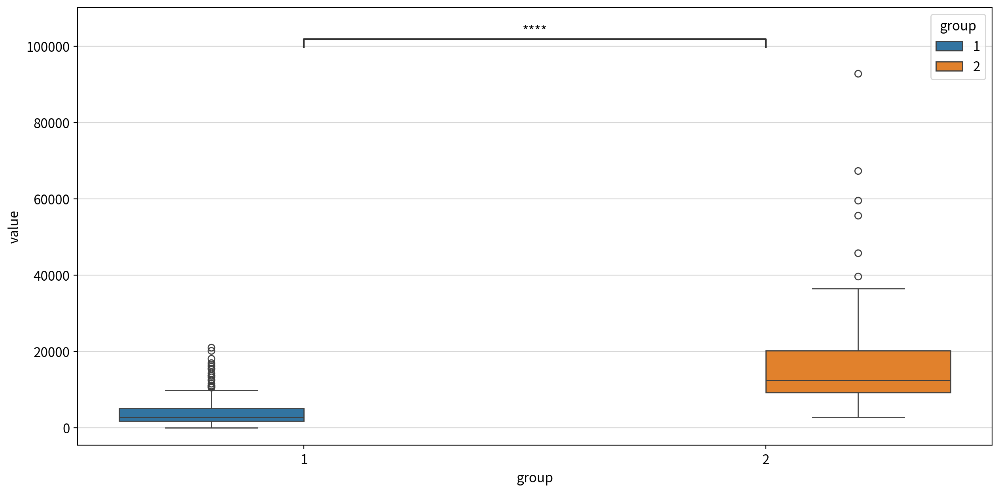 | 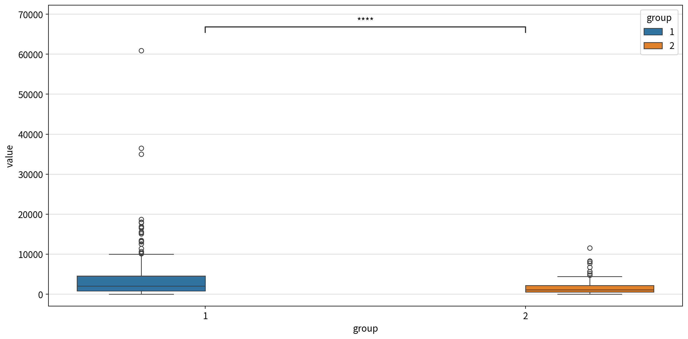 |
| **Detergents_Paper** | **Delicassen** |
| 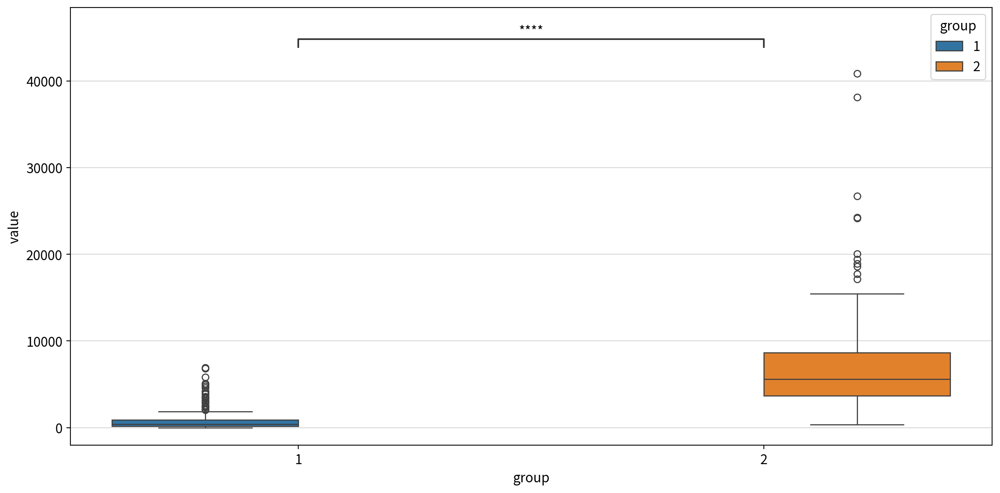 | 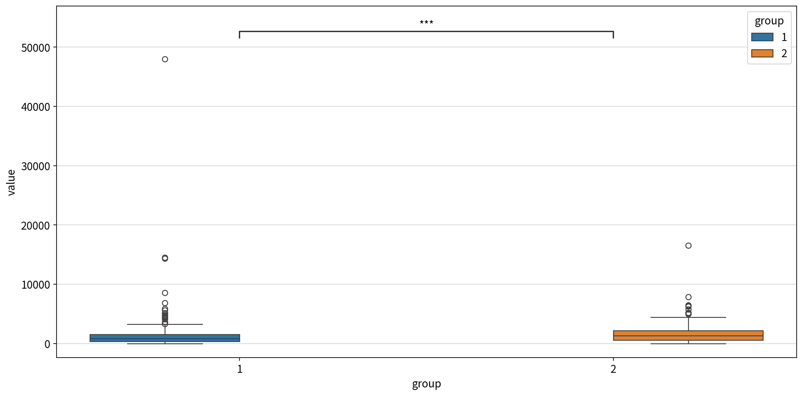 |

*그림 4. 채널별 구매액 박스플롯 (group 1: Horeca, 2: Retail / \*\*\*\*: p ≤ 0.0001)*

- 6개 변수 모두 두 채널 간 차이가 유의하지만, 효과크기는 0.20~0.92로 약 4배 차이가 난다.
- **채널을 가르는 핵심 변수는 `Detergents_Paper`, `Grocery`, `Milk`** 이고, 나머지 세 변수는 보조 정보다.
- Horeca는 `Fresh`·`Frozen`이 상대적으로 높고, Retail은 `Milk`·`Grocery`·`Detergents_Paper`·`Delicassen`이 높다.

### 2-4. 다변량 분석

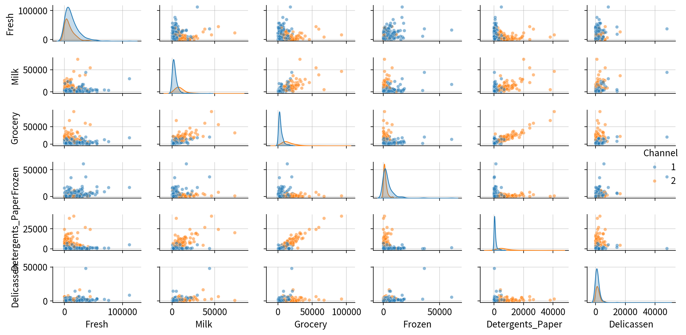
*그림 5. 채널별 산점도 행렬 (Pairplot)*

- **상관관계:** `Milk`·`Grocery`·`Detergents_Paper` 사이에 높은 양의 상관이 있다(전체 고객 기준 Spearman: `Grocery`–`Detergents_Paper` 0.801, `Milk`–`Grocery` 0.773, `Milk`–`Detergents_Paper` 0.680). Pearson 기준으로는 `Grocery`–`Detergents_Paper`가 0.925로 더 높은데, 고액 고객이 선형 상관을 키운 것이므로 이상치에 덜 민감한 Spearman 값을 기준으로 해석한다. 세 변수가 비슷한 구매 규모 정보를 중복으로 담고 있어, 그대로 거리 기반 분석에 쓰면 이 축이 과도하게 반영될 수 있다.
  - 채널별 Spearman 상관: Retail에서는 `Grocery`–`Detergents_Paper`가 0.854로 매우 강하고, Horeca에서는 최대 0.581(`Milk`–`Grocery`)로 중간 수준이다.
- 반면 `Fresh`, `Frozen`, `Delicassen`은 위 세 변수와 다른 구매 패턴을 보여, 고객의 구매 성향을 구분하는 별도의 축을 형성할 가능성이 있다.
- 채널별 산점도에서도 `Milk`·`Grocery`·`Detergents_Paper` 중심의 구매 패턴과 `Fresh`·`Frozen` 중심의 구매 패턴이 구분되는 경향이 나타난다. 고객 채널은 단일 품목이 아니라 여러 품목이 조합된 구매 패턴으로 설명될 수 있다.
- **다중공선성:** 최대 VIF = 8.79로 임계값(VIF ≥ 10)을 넘는 변수가 없으므로 6개 변수를 모두 사용한다.
- **탐색용 PCA(원본 데이터):** 주성분 3개로 84.8%를 설명한다. PC1은 Milk·Grocery·Detergents_Paper, PC2는 Fresh·Frozen·Delicassen 중심이고, PC3는 Fresh(0.812)와 Delicassen(-0.524)이 반대 방향인 "신선식품 vs 즉석식품" 축이다. 다만 표준화만 하고 왜도 보정(로그/Yeo-Johnson)은 하지 않은 상태라 극단값의 영향을 받으므로, 최종 PCA는 Yeo-Johnson 변환·표준화 후 다시 수행한다(3-2).

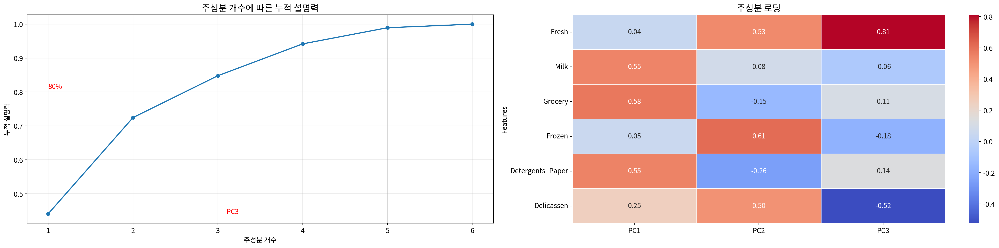
*그림 6. EDA 단계 PCA 결과 (원본 데이터 기준)*

- **결론:** 변수 간 중복 정보를 줄이고 종합적인 구매 성향을 보기 위해 **PCA**를 적용한다.

---

## 3. 모델링

### 3-1. 데이터 전처리

#### 분포 변환: 로그 변환 → Yeo-Johnson 변환으로 교체

| 변수 | 원본 왜도 | 로그 변환 후 | **Yeo-Johnson 변환 후** |
|---|---|---|---|
| `Fresh` | 2.55 | -1.62 | **-0.041** |
| `Milk` | 4.04 | -0.23 | **0.001** |
| `Grocery` | 3.58 | -0.74 | **0.031** |
| `Frozen` | 5.89 | -0.36 | **0.003** |
| `Detergents_Paper` | 3.62 | -0.27 | **-0.017** |
| `Delicassen` | 11.11 | -1.17 | **0.096** |

- 로그 변환을 하자 `Fresh`(-1.62), `Delicassen`(-1.17)의 왜도가 반대 방향으로 **과보정**되었다. 앞서 우려한 최소값 3에 의한 하한 왜곡이다.
- **Yeo-Johnson 변환**을 적용하자 6개 변수의 왜도가 모두 ±0.1 이내로 안정되었다.

#### 표준화

- StandardScaler를 적용해 6개 변수 모두 평균 0, 표준편차 1로 맞췄다.
- `Delicassen`은 변환 후에도 최대값 4.95로 꼬리가 남아 있어, 초고소비 조리식품 고객이 별도의 소그룹으로 분리될 가능성이 있다.

### 3-2. PCA 차원축소

누적 설명력 80% 이상이 되는 주성분 개수를 군집분석 입력으로 사용했다. 그 결과 **주성분 3개로 83.1%** 를 설명한다.

| 주성분 | 설명력 | 누적 설명력 | 주요 구성 변수 | 해석 |
|---|---|---|---|---|
| PC1 | 44.9% | 44.9% | Milk(0.54), Grocery(0.57), Detergents_Paper(0.55) | 소매(Retail) 성향 축 |
| PC2 | 28.0% | 72.9% | Fresh(0.59), Frozen(0.60), Delicassen(0.52) | 요식업(Horeca) 성향 축 |
| PC3 | 10.2% | 83.1% | Fresh(+0.73) vs Delicassen(-0.63) | 신선식품 vs 즉석식품 축 |

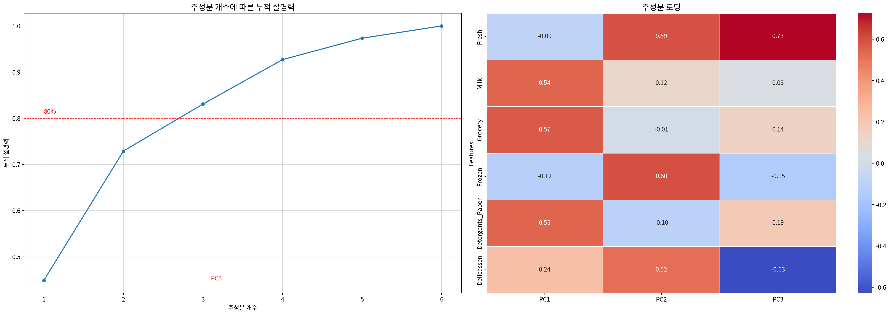
*그림 7. 주성분별 변수 적재량*

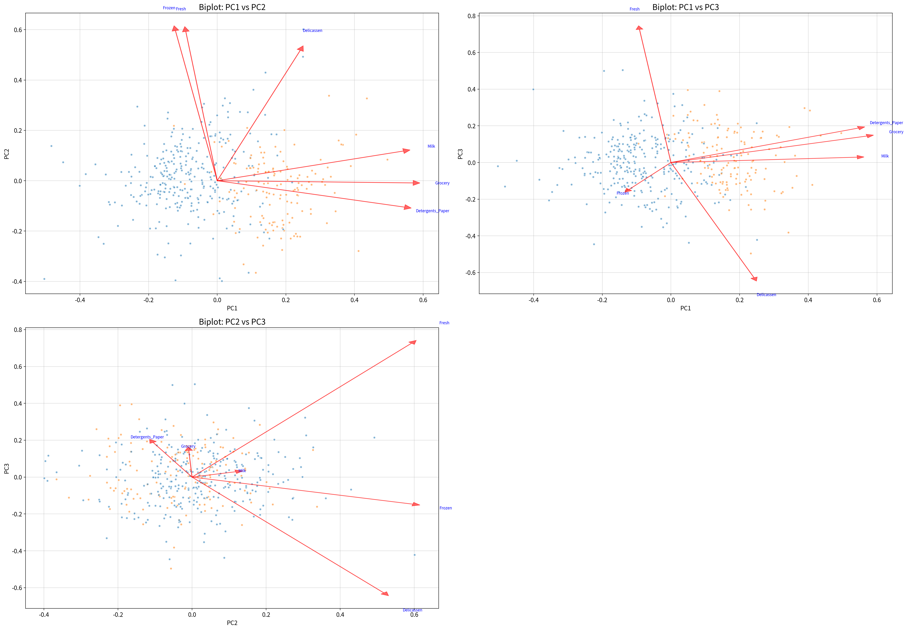
*그림 8. PCA Biplot (파랑: Horeca, 주황: Retail)*

- `Detergents_Paper`는 PC1의 핵심 구성 변수(적재량 0.546)로, 채널 판별력 1위 변수라는 사실이 PCA 이후에도 유지된다.
- PC1만 쓰면 Fresh·Frozen 축(PC2)과 신선 vs 즉석식품 축(PC3)의 정보가 빠지므로, 이후 군집분석은 PC1~PC3를 함께 사용한다.

### 3-3. KMeans 군집분석

#### 최적 군집 수 결정

| 방법 | 결과 |
|---|---|
| 엘보우 | k = 4 이후 이너셔 감소폭이 둔화 (160.6 → 104.1) |
| 실루엣 점수 | k = 2가 최고 (0.358), k = 4는 0.281 |
| 실루엣 균형지수 | k = 5가 최고 (0.804) |

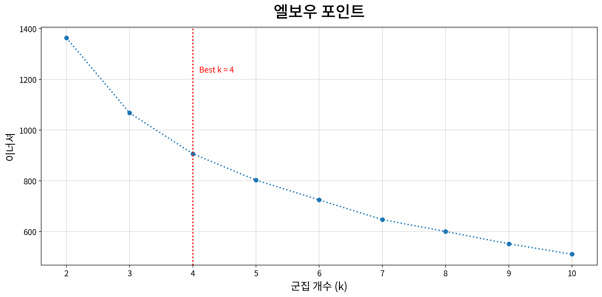
*그림 9. 엘보우 기법 (k별 이너셔)*

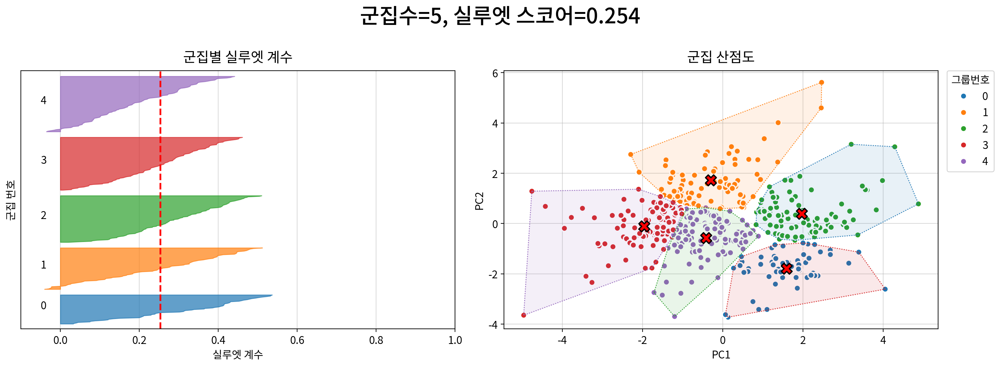
*그림 10. k별 실루엣 점수 및 균형지수*

- 실루엣은 k = 2에서 최고점이지만, 이는 채널을 가르는 PC1이 지배하는 구조를 그대로 반영한 결과다. k = 2를 채택하면 **군집이 Channel을 그대로 복제할 위험**이 있다.
- 엘보우는 k = 4 부근에서 이너셔 감소폭이 꺾인다. "최소 2개 이상의 그룹"을 충족하면서 더 세분화된 페르소나 구조를 포착할 수 있다.
- 따라서 통계적 최적 분리보다 **페르소나 세분화와 오분류 탐색을 우선해 k = 4를 채택**했다. 다만 k = 4의 실루엣은 0.28로 군집 경계가 뚜렷하지 않다.

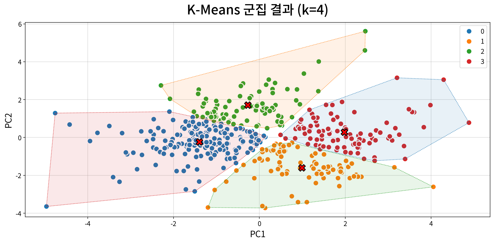
*그림 11. K-Means 군집 결과 (k=4, PC1–PC2 평면, ✖: 군집 중심)*

#### 페르소나 정의

군집은 `Channel` 없이 6개 구매 변수만으로 만들었고, 이름도 품목 구성 비중과 총구매 규모만 보고 붙였다.

| 군집 | 페르소나 | 고객 수 (비중) | 총구매액 중앙값 | 매출 비중 | 주요 구매 비중 |
|---|---|---|---|---|---|
| C0 | **소량 신선식품 중심형** | 181명 (41.1%) | 17,415 | 22.3% | Fresh 50%, Frozen 14% |
| C1 | **소량 가공식품·생활용품 중심형** | 78명 (17.7%) | 26,498 | 14.4% | Grocery 40%, Milk 25%, Det_Paper 15% |
| C2 | **대량 신선·냉동·델리 구매형** | 81명 (18.4%) | 43,394 | 27.2% | Fresh 53%, Frozen 18%, Delicassen 6% |
| C3 | **대량 가공식품·생활용품 구매형** | 100명 (22.7%) | 45,968 | 36.1% | Grocery 33%, Milk 23%, Det_Paper 14% |

- 4개 군집은 **품목 구성(신선 vs 가공·생활용품) × 구매 규모(소량 vs 대량)** 의 2×2 구조다.

#### 페르소나 × 채널 교차표

| Channel \ 군집 | C0 | C1 | C2 | C3 | 합계 |
|---|---|---|---|---|---|
| 1 (Horeca) | **178** | 33 | **74** | 13 | 298 |
| 2 (Retail) | 3 | **45** | 7 | **87** | 142 |
| 합계 | 181 | 78 | 81 | 100 | 440 |

- 신선 중심 페르소나(C0, C2)는 Horeca에, 가공·생활용품 중심 페르소나(C1, C3)는 Retail에 몰려 있다.

---

## 4. 채널예측

구매 변수 6개와 페르소나(군집)로 채널(1: Horeca, 2: Retail)을 예측한다.

### 4-1. 데이터 분할 및 특성 생성

- 입력(X)은 구매 변수 6개(Yeo-Johnson 변환) + 페르소나 군집 번호이며, **`Channel`은 정답(Y)으로만 사용**한다.
- 원본을 가장 먼저 **Train 352명 / Test 88명(8:2, 층화 추출)** 으로 나눴다(Train 채널 비율 67.6 : 32.4, Test 68.2 : 31.8).
- Yeo-Johnson 변환, PCA, KMeans 군집화, 스케일링은 **모두 Train에만 fit** 하고 Test에는 transform/predict만 적용해 데이터 누수를 막았다.

### 4-2. 모델 구성

| 모델 | 주요 설정 | 전처리 |
|---|---|---|
| LogisticRegression | `class_weight='balanced'`, max_iter=1000 | VIF ≥ 10 변수 제거 → 표준화, 군집 더미(drop_first) |
| KNN | n_neighbors=5 | 표준화, 군집 더미 |
| SVM | `class_weight='balanced'`, probability=True | 표준화, 군집 더미 |
| RandomForest | n_estimators=300, `class_weight='balanced'` | 군집 더미 |
| GradientBoosting | 기본값 | 군집 더미 |

- 채널 불균형(67.7 : 32.3)을 고려해 주요 모델에 `class_weight='balanced'`를 적용했다.

### 4-3. 교차검증으로 모델 선택 (Train 내부)

Train을 **StratifiedKFold(5)** 로 나누고, 폴드마다 전처리·군집화를 새로 fit했다. 평균 Macro F1이 가장 높은 모델을 최종 모델로 고른다.

| 모델 | Accuracy | Macro Recall | Macro F1 (mean ± std) |
|---|---|---|---|
| **RandomForest** | 0.9175 | 0.9110 | **0.9062 ± 0.031** |
| GradientBoosting | 0.9119 | 0.9023 | 0.8990 ± 0.049 |
| SVM | 0.8949 | 0.9036 | 0.8846 ± 0.031 |
| KNN | 0.8950 | 0.8923 | 0.8825 ± 0.034 |
| LogisticRegression | 0.8920 | 0.9012 | 0.8818 ± 0.027 |

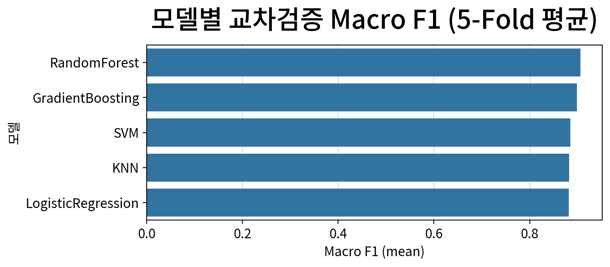
*그림 12. 모델별 교차검증 Macro F1 (5-Fold 평균)*

- 교차검증 Macro F1 기준으로 **RandomForest**를 최종 모델로 선택했다.
- 다만 5개 모델이 0.88~0.91 구간에 몰려 있어 모델 간 우열은 크지 않다. 핵심은 **"어떤 모델을 쓰든 구매 패턴만으로 채널이 약 90% 구분된다"** 는 점이다.

### 4-4. 최종 평가 (Test 1회)

Train 전체로 다시 학습한 뒤 Test에서 한 번만 평가했다. Test 결과는 모델 선택에 쓰지 않는다.

| 모델 | Accuracy | Macro Precision | Macro Recall | Macro F1 |
|---|---|---|---|---|
| **RandomForest** | **0.9545** | 0.9476 | 0.9476 | **0.9476** |
| GradientBoosting | 0.9205 | 0.9117 | 0.9036 | 0.9074 |
| SVM | 0.9318 | 0.9161 | 0.9310 | 0.9229 |
| KNN | 0.9318 | 0.9214 | 0.9214 | 0.9214 |
| LogisticRegression | 0.9432 | 0.9313 | 0.9393 | 0.9351 |

**RandomForest 채널별 성능 및 혼동행렬**

| 채널 | Precision | Recall | F1 | Support |
|---|---|---|---|---|
| Horeca | 0.9667 | 0.9667 | 0.9667 | 60 |
| Retail | 0.9286 | 0.9286 | 0.9286 | 28 |

| | 예측 Horeca | 예측 Retail |
|---|---|---|
| **실제 Horeca** | 58 | 2 |
| **실제 Retail** | 2 | 26 |

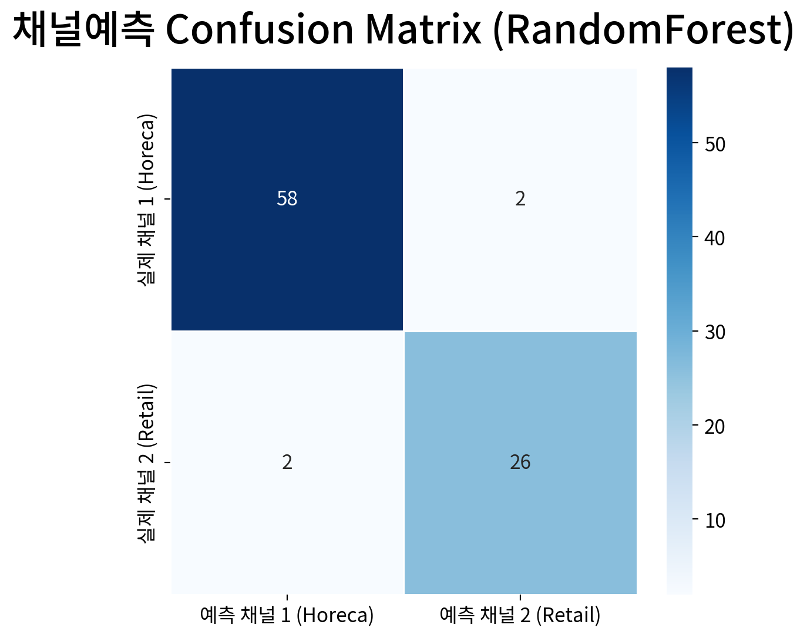

*그림 13. RandomForest 혼동행렬 (Test 88명)*

- Test 성능(0.948)은 교차검증(0.906 ± 0.031)보다 높고 1 표준편차 범위(최대 0.937)도 넘지만, Test가 88명이라 1~2명 차이로도 F1이 크게 흔들린다. 과적합이라면 Test 성능이 오히려 낮아야 하므로 과적합 신호로 보지 않는다.
- 기준선(67.7%) 대비 **약 28%p 향상**되었다. 채널별 구매 구조가 뚜렷하게 다르다는 뜻이다.
- Test에서는 `LogisticRegression`(0.9351)이 2위였지만, Test 결과는 모델 선택에 쓰지 않는다는 원칙에 따라 교차검증 1위 모델을 유지한다.
- 오분류는 양방향 2건씩이지만, 채널별 오류율은 Horeca 3.3%(2/60), Retail 7.1%(2/28)로 소수 채널인 Retail에서 약 2배 높다.
- `class_weight='balanced'`를 적용해 Retail Recall 0.93을 확보했다. 다만 가중치를 빼고 비교하지는 않았으므로 가중치 자체의 효과는 확인되지 않았다.

#### 변수 중요도

| 변수 | 중요도 |
|---|---|
| Detergents_Paper | 0.342 |
| Grocery | 0.227 |
| Milk | 0.155 |
| Frozen | 0.061 |
| Delicassen | 0.042 |
| Fresh | 0.041 |
| 군집 더미 합계 | 0.132 |

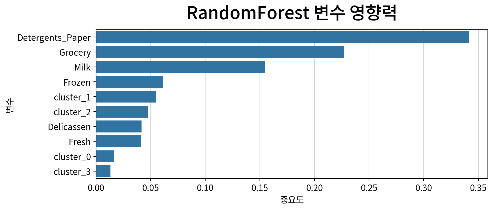
*그림 14. RandomForest 변수 중요도*

- **Retail 품목 3개(Detergents_Paper·Grocery·Milk)가 전체 중요도의 약 72%** 를 차지한다. PCA의 PC1(소매 성향 축)과 일치하는 결과다.
- `Fresh` 중요도는 0.041로 낮다. 두 채널 모두 신선식품을 사기 때문이다. 즉 Horeca는 **"신선식품을 많이 사서"가 아니라 "Retail 품목을 적게 사서"** 구분된다.
- 군집 더미는 합계 0.13으로 **보조 신호**다. 채널 구분의 핵심은 원본 구매액(특히 세제·종이)이다.

---

## 5. 오분류 고객 추출

Test 88명 중 오분류 고객은 **4명(4.5%)** 이다.

| 고객 idx | 실제 → 예측 | 예측신뢰도 | 구매 특징 | 유형 |
|---|---|---|---|---|
| 181 | Horeca → Retail | **0.52** | Fresh 112,151(전체 최대값), 전 품목 구매액이 극단적으로 큼 | 규모 이상치형 |
| 342 | Horeca → Retail | 0.61 | Fresh 255로 매우 낮고 Det_Paper 4,595로 소매 패턴 | 카테고리 이탈형 |
| 223 | Retail → Horeca | **0.98** | Det_Paper 788로 낮고 Frozen 5,612로 높음 | 라벨-행동 불일치형 |
| 11 | Retail → Horeca | **0.997** | Fresh 13,146, Det_Paper 549로 식자재 패턴 | 라벨-행동 불일치형 |

오분류는 예측신뢰도에 따라 두 그룹으로 뚜렷하게 나뉜다.

- **저신뢰 오분류 (0.52~0.61, 모두 Horeca → Retail):** 모델도 확신하지 못한 경계 고객이다. 특히 idx 181은 사실상 50:50으로, 구매 규모가 극단적이라 판단이 어려운 경우다.
- **고신뢰 오분류 (0.98 이상, 모두 Retail → Horeca):** 모델은 확신하는데 등록 라벨과 다르다. 등록 채널(Retail)과 실제 구매 행동(Horeca형)이 어긋난 고객으로 해석한다.

오분류가 무작위가 아니라 **특정 구매 패턴(신선·냉동 중심 Retail, 생활용품 중심 Horeca)에서 발생**한다. 채널예측 단계의 군집 번호는 Train에만 fit한 KMeans 결과라서 3-3의 페르소나 번호(C0~C3)와 다를 수 있다.

#### 인사이트

- **예측신뢰도를 액션 강도로 쓴다:** 신뢰도가 높을수록 즉시 대응하고, 낮을수록 검증을 우선한다.
- **채널 라벨 검증 도구로 활용:** 구매 데이터만으로 채널을 약 95% 맞히므로, "예측 ≠ 등록 채널 & 신뢰도 0.9 이상" 고객을 정기적으로 추출하면 채널 정보 점검 리스트가 된다.
- **Retail 고객의 Det_Paper 감소는 이탈·업태 변화 신호:** 가장 강력한 판별 변수이므로 모니터링 지표로 쓸 수 있다.

---

## 6. 결론 및 오분류 고객 마케팅 전략

### 6-1. 가설 검증 결과

| 단계 | 가설 | 결과 | 근거 |
|---|---|---|---|
| 1단계 | 가설1. 2개 이상의 뚜렷한 소비 패턴 그룹이 존재한다 | 지지 | 품목 구성 × 구매 규모의 4개 페르소나 도출. 단, 실루엣 0.28로 군집 경계는 뚜렷하지 않음 |
| 1단계 | 가설2. Horeca는 Fresh·Frozen, Retail은 Grocery·Milk·Det_Paper 비중이 높다 | 부분 지지 | 구매 비중은 가설대로 나타남(Horeca가 몰린 C0·C2는 Fresh 50% 이상, Retail이 몰린 C1·C3는 Grocery·Milk·Det_Paper 중심). 그러나 채널 판별력은 Retail 품목 3개가 중요도의 72%이고 Fresh는 0.04로 낮음 → Horeca는 "Retail 품목을 적게 사서" 구분됨 |
| 2단계 | 가설3. 오분류는 특정 소비 패턴에 집중된다 | 지지 | 오분류 4명 모두 자기 채널의 전형 패턴에서 벗어난 고객(생활용품 중심 Horeca, 신선·냉동 중심 Retail, 초고액 고객) |
| 3단계 | 가설4. 오분류 고객은 채널 전환/혼합형 고객이다 | 부분 지지 | idx 223·11은 예측신뢰도 0.98 이상으로 등록 채널과 실제 행동이 불일치. 단, 모델 신뢰도만으로 라벨 오류를 확정할 수 없어 실제 업태 확인이 필요함 |
| 3단계 | 가설5. 오분류 고객의 구매액은 정분류 고객과 다르다 | 부분 지지 | 3명(342·223·11)은 총구매액 하위 28~35%의 소액 고객, 1명(181)은 상위 0.7%의 초고액 고객. 단, 표본 4명이라 일반화는 어려움 |

### 6-2. 분석 질문에 대한 답

**Q1. 채널 정보 없이도 채널을 구분할 수 있는가?**
구매 변수 6개만으로 채널을 Test 기준 **95.5%** 맞힌다(기준선 67.7%). 채널 구분은 대부분 가능하며, 오분류는 88명 중 4명(4.5%)뿐이다.

**Q2. 페르소나와 실제 채널이 어긋나는 이유는 무엇인가?**
오분류는 모델의 실수보다 **고객의 구매 행동이 등록 채널과 다르기 때문**에 발생한다. 원인은 세 가지로 나뉜다.

- **카테고리 이탈:** 특정 품목을 다른 공급처에서 조달하고 있을 가능성이 있다 (idx 342).
- **규모 이상치:** 구매 규모가 극단적이라 모델이 판단하기 어렵다 (idx 181).
- **라벨-행동 불일치:** 등록은 Retail이지만 실제로는 Horeca처럼 구매한다 (idx 223, 11).

### 6-3. 오분류 고객 마케팅 전략

> **원칙:** 등록 채널은 그대로 두고, 우리 쪽의 서비스·제안을 실제 구매 행동에 맞춘다.
> 예측신뢰도는 액션 강도로 쓴다. 높을수록 바로 실행, 낮을수록 검증부터 한다.

- **운영 방안:** 신규 구매 데이터가 쌓일 때마다 채널예측 모델로 "예측 채널 ≠ 등록 채널" 고객을 정기적으로 추출하고, 예측신뢰도 순으로 정렬해 영업·마케팅 우선순위 리스트로 사용한다.

#### 유형 A. 라벨-행동 불일치형 — idx 223, 11 (Retail → Horeca)

- **진단**: Retail로 등록되어 있지만 Fresh 또는 Frozen 비중이 높고(idx 11: Fresh 62%, idx 223: Frozen 31%) Det_Paper가 매우 낮다(788, 549). 신선·조리 코너를 운영하는 매장이거나 업태가 Horeca 쪽으로 바뀐 고객으로 추정된다. 총구매액(약 1.8만~2.1만)은 Retail 중앙값(약 3.7만)의 절반 수준으로, **성장 여지가 큰 고객**이다.
- **액션**
  1. **서비스 전환**: Retail 카탈로그 대신 **신선·냉동 식자재 카탈로그를 우선 노출**하고, Horeca 채널의 전문 영업사원을 배정한다.
  2. **정기배송 제안**: 신선·냉동 품목의 주/월 단위 정기배송으로 구매 주기를 고정한다.
  3. **교차판매**: Retail 핵심 품목(Grocery·Det_Paper)의 구매가 Retail 평균보다 크게 낮으므로, 신선 정기배송에 생활용품을 묶은 번들 할인을 제공한다.
  4. **등록 정보 확인**: 실제 업태를 업데이트 배너를 통해 확인하고, 변화가 확인되면 채널 정보를 갱신한다.

#### 유형 B. 카테고리 이탈형 — idx 342 (Horeca → Retail, 신뢰도 0.61)

- **진단**: Horeca인데 Fresh 구매가 255로 거의 없고 Milk·Grocery·Det_Paper 위주로 산다. 신선식품을 **다른 공급처나 현지 시장에서 조달**하고 있을 가능성이 있다.
- **액션**
  1. **검증**: 신뢰도가 낮으므로 최근 주문 이력을 확인해 일시적 변동인지 구조적 이탈인지 판단한다.
  2. **이탈 원인 파악**: 영업사원 컨택으로 가격·신선도·납품 주기 중 어떤 점이 경쟁 열위인지 확인한다.
  3. **재유입 오퍼**: 원인에 맞춰 **Fresh 첫 구매 체험 및 할인가, 소량·고빈도 납품 허용** 등의 조건을 제시한다.

#### 유형 C. 규모 이상치형 — idx 181 (Horeca → Retail, 신뢰도 0.52)

- **진단**: 총구매액 190,169로 전체 상위 0.7%의 초대형 고객이다. 전 품목을 대량으로 사서 Milk·Grocery 절대액도 커졌고, 그래서 모델이 Retail로 봤다. 이는 패턴 문제가 아니라 **규모 문제**다.
- **액션**
  1. **Key Account(핵심 거래처)로 관리**하여 전담 계정관리자 배정, 개별 계약가·납품 조건(SLA) 협상, 대량구매할인 프로모션 등을 진행한다.
  2. 이탈 시 매출 손실이 크므로 **이탈 방지(리텐션)** 를 최우선 목표로 둔다.
  3. 분석 측면에서는 향후 채널예측 시 초고액 고객을 별도 그룹으로 플래그 처리한다.

---

## 7. 한계 및 향후 과제

- **표본 한계**: 오분류 전략은 Test(88명) 중 4명에 근거한다. 440명 전체의 예측을 만들어 오분류 표본을 늘리면 유형 분류를 검증하고, 유형별 마케팅 전략을 더 유연하게 설계할 수 있다.
- **데이터 한계**: 누적 구매액만 있어 시점별 변화(업태 전환 시기 등)를 확인할 수 없고, 어느 연도의 데이터인지 구분할 수 없어 현재 시장에 그대로 적용하기 어렵다.
- **실행 검증**: 위 전략은 데이터 기반 가설이다. 실제 적용 시 일부 고객 대상 **파일럿(A/B 테스트)** 으로 효과를 확인한 뒤 확대해야 한다.
